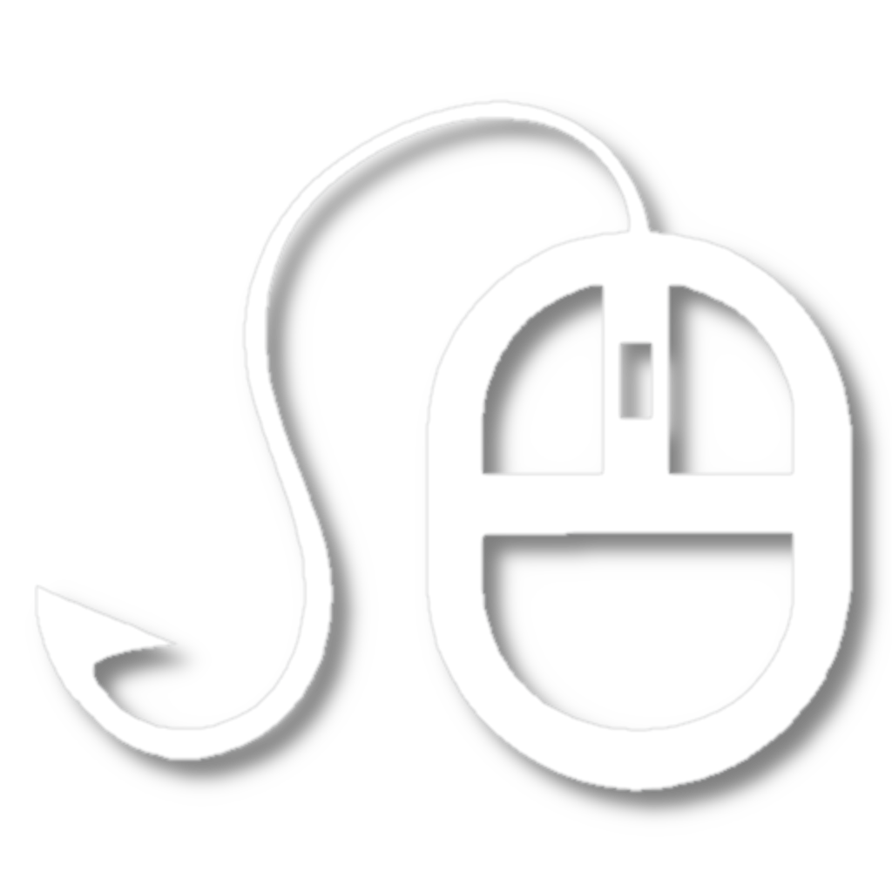
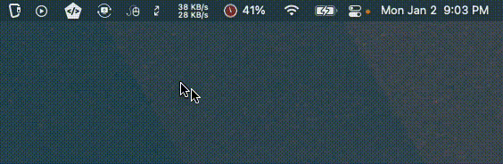

# MouseHook



MouseHook is an open source macOS app written in Swift that allows you to hook a duplicate mouse cursor to your mouse's location and have it mimic the appearance of your mouse. This is especially useful for fixing the annoying issue where Parsec doesn't show the host mouse when using it as a monitor extender.

Please note that MouseHook has only been developed and tested in my personal environment and I cannot provide any guarantees that it will work in other environments. Use at your own risk.

Binaries have been provided supporting Macos >= 10.15. Some language features used are not supported by older versions of Macos.

## Installation

To install MouseHook, download the latest release from the releases page and drag the app to your Applications folder. You may have to allow unsigned applications in `Security and Privacy`.

Alternatively, you can clone the repository and build the app from source:

```
git clone https://github.com/brgj/MouseHook.git
cd MouseHook
xcodebuild
```

## Usage

To use MouseHook, simply launch the app and click the app icon in the menu bar. Any monitors currently allowing mousehook functionality will appear with a ✅ and ones that are disabled will appear with an ❌. By clicking the monitor label, it will toggle functionality for that monitor. Monitors are disabled by default.

### Demo



## License

MouseHook is licensed under the Apache License v2.
